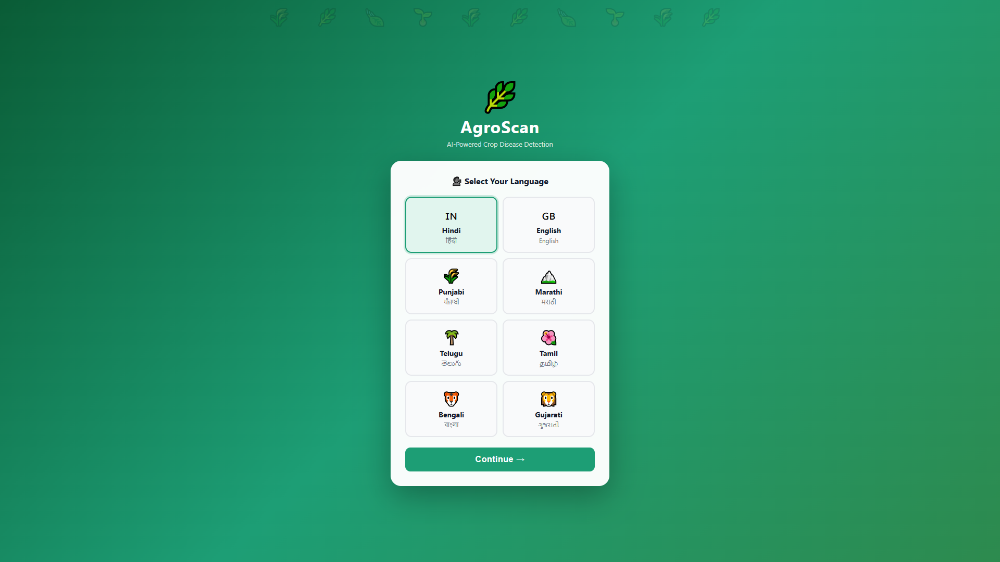
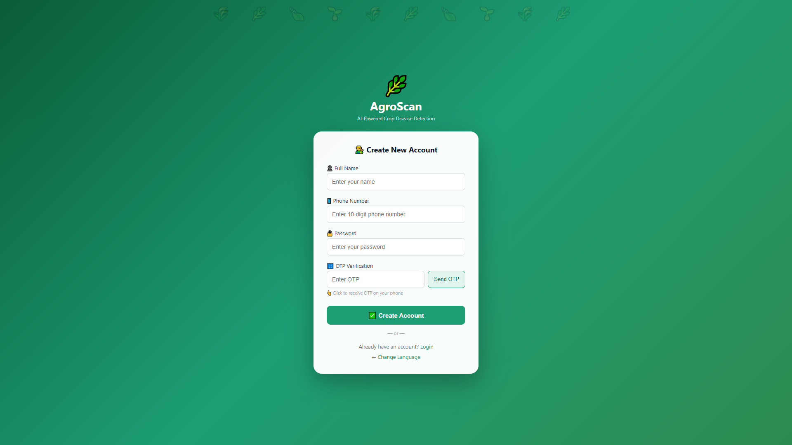
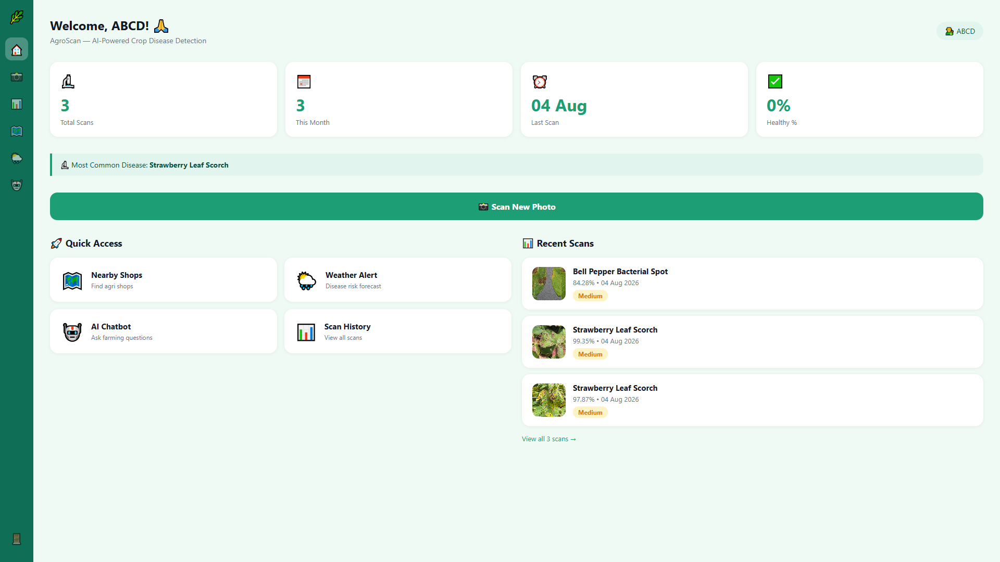
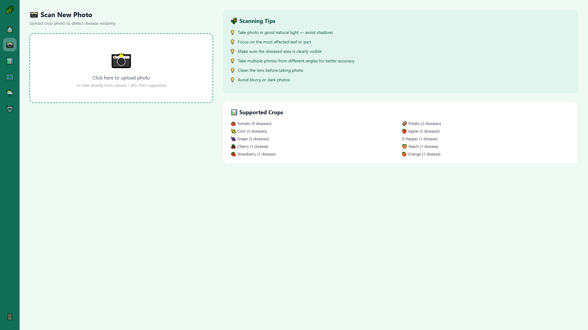
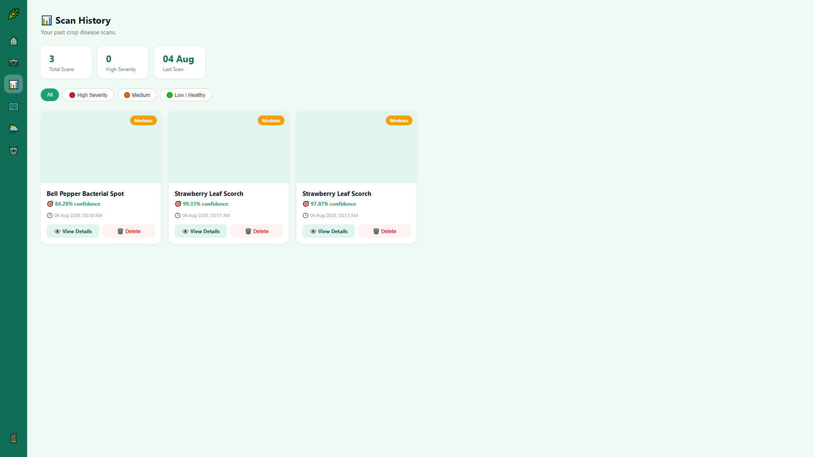
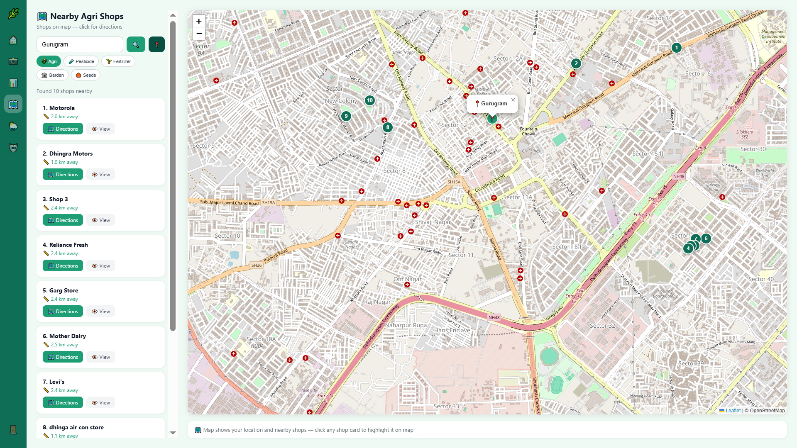
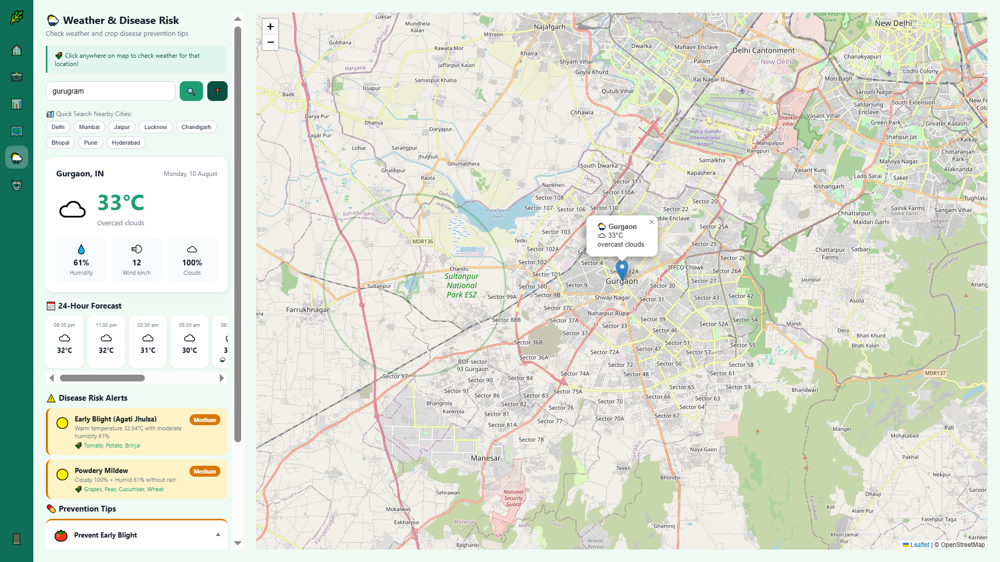
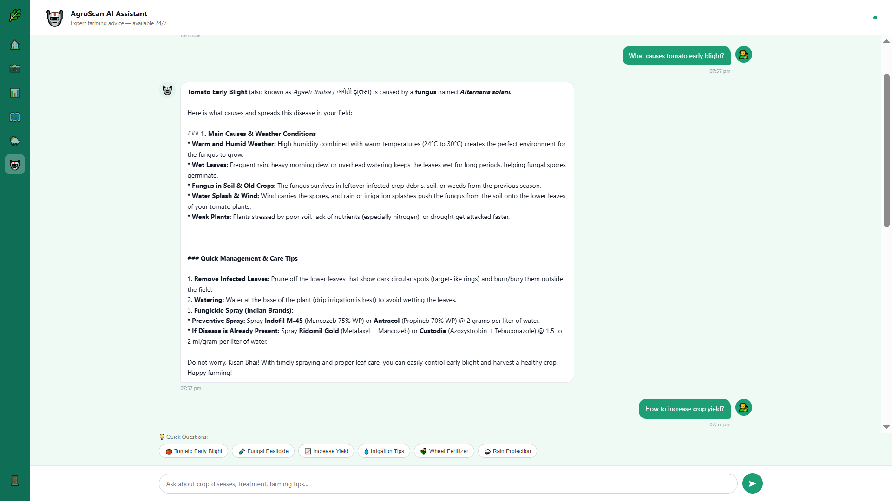

<div align="center">

# 🌿 AgroScan
### AI-Powered Crop Disease Detection for Indian Farmers

[](https://www.python.org/)
[](https://flask.palletsprojects.com/)
[](https://www.tensorflow.org/)
[](LICENSE)

Snap a photo of a crop leaf → get an instant disease diagnosis, treatment plan, and nearby agri-shop recommendations — in your own language.

[Features](#-features) • [Screenshots](#-screenshots) • [Tech Stack](#%EF%B8%8F-tech-stack) • [Setup](#-getting-started) • [Project Structure](#-project-structure)

</div>

---

## 📖 About

AgroScan tackles a real problem for Indian farmers: crop diseases often go undiagnosed until it's too late, and language + access to agronomists is a barrier. AgroScan puts a full crop-health toolkit in a farmer's pocket — disease detection, weather-based risk alerts, nearby shop discovery, and a 24/7 AI advisor — all in **8 Indian languages**.

## ✨ Features

<table>
<tr>
<td width="50%" valign="top">

**📸 Instant Disease Detection**
Upload or capture a leaf photo and get an AI diagnosis in seconds — powered by a fine-tuned MobileNetV2 model trained on 38+ disease classes across 10 crops (PlantVillage dataset).

**🌐 8-Language Support**
Hindi, English, Punjabi, Marathi, Telugu, Tamil, Bengali, Gujarati — built for real farmers, not just English speakers.

**📊 Dashboard & Scan History**
Track total scans, most common disease, healthy %, and revisit past diagnoses with full treatment details.

</td>
<td width="50%" valign="top">

**🗺️ Nearby Agri Shops**
Free map-based shop finder (Leaflet.js + OpenStreetMap + Overpass API) with live in-browser routing — no paid API keys needed.

**🌦️ Weather-Based Disease Risk**
Live weather (OpenWeatherMap) converted into rule-based disease risk forecasts with prevention tips.

**🤖 AI Farming Chatbot**
Gemini-powered assistant answering crop care, pesticide, and treatment questions in simple Hindi/Hinglish.

</td>
</tr>
</table>

---

## 📸 Screenshots

<div align="center">

| | |
|---|---|
| **Language Selection** <br>  | **Create Account** <br>  |
| **Dashboard** <br>  | **Scan New Photo** <br>  |
| **Scan History** <br>  | **Nearby Agri Shops** <br>  |
| **Weather & Disease Risk** <br>  | **AI Chatbot** <br>  |

</div>

---

## 🛠️ Tech Stack

| Layer | Technology |
|---|---|
| **Backend** | Flask, Flask-Login, SQLAlchemy |
| **Database** | SQLite |
| **ML Model** | TensorFlow / Keras — MobileNetV2 (two-phase transfer learning) |
| **Dataset** | PlantVillage (54,000+ images, 38 disease classes) |
| **Maps** | Leaflet.js, OpenStreetMap, Overpass API, Nominatim |
| **Weather** | OpenWeatherMap API |
| **Chatbot** | Google Gemini API |
| **Frontend** | HTML, CSS, Vanilla JS (Jinja2 templates) |

---

## 🚀 Getting Started

### Prerequisites
- Python 3.11+
- pip

### 1. Clone & set up environment

```bash
git clone https://github.com/Aarti-1209/Agroscan.git
cd Agroscan

python -m venv venv
venv\Scripts\activate      # Windows
# source venv/bin/activate # macOS/Linux

pip install -r requirements.txt
```

### 2. Configure environment variables

Copy the example file and fill in your own keys:

```bash
cp .env.example .env
```

```
WEATHER_API_KEY=your_openweathermap_key
GEMINI_API_KEY=your_gemini_api_key
SECRET_KEY=your_flask_secret_key
```

### 3. Get the dataset & train the model

Download the [PlantVillage dataset](https://www.kaggle.com/datasets/mohitsingh1804/plantvillage) and place it at:

```
dataset/plantvillage dataset/color/
```

```bash
python Model/clean_dataset.py   # removes corrupt/unreadable images
python Model/train.py           # two-phase training: frozen base + fine-tuning
```

This generates `Model/plant_disease.h5` and `Model/class_names.json`.

### 4. Run the app

```bash
python app.py
```

Visit **http://127.0.0.1:5000** in your browser. 🎉

---

## 📁 Project Structure

```
Agroscan/
├── app.py                    # Main Flask application & routes
├── database.py
├── disease_info.py           # Disease name, symptoms & treatment lookup
├── requirements.txt
├── .env.example               # Template for required environment variables
├── Model/
│   ├── train.py               # Two-phase transfer learning + fine-tuning
│   ├── clean_dataset.py        # Dataset corruption checker
│   ├── plant_disease.h5        # Trained model (gitignored)
│   └── class_names.json
├── Templates/                  # Jinja2 HTML templates
├── static/uploads/             # User-uploaded scan images (gitignored)
├── languages/                  # i18n JSON files (8 languages)
├── screenshots/                # README screenshots
└── dataset/                    # PlantVillage dataset (gitignored)
```

---

## 🎯 Model Training Approach

AgroScan uses a **two-phase transfer learning** strategy on MobileNetV2 to maximize accuracy on visually similar disease classes:

1. **Phase 1 — Frozen Base:** 15 epochs training a custom classification head on top of a frozen, ImageNet-pretrained MobileNetV2.
2. **Phase 2 — Fine-Tuning:** The last 30 layers of the base model are unfrozen and fine-tuned at a very low learning rate (`1e-5`) for 8 more epochs.

The training script automatically compares validation accuracy across both phases and only keeps the fine-tuned model if it actually outperforms the frozen-base version — preventing accidental regressions.

---

## 🙏 Acknowledgements

- [PlantVillage Dataset](https://www.kaggle.com/datasets/mohitsingh1804/plantvillage)
- [OpenStreetMap](https://www.openstreetmap.org/) & [Leaflet.js](https://leafletjs.com/)
- [OpenWeatherMap](https://openweathermap.org/)
- [Google Gemini API](https://ai.google.dev/)

---

<div align="center">

Built with 💚 for Indian farmers

</div>
